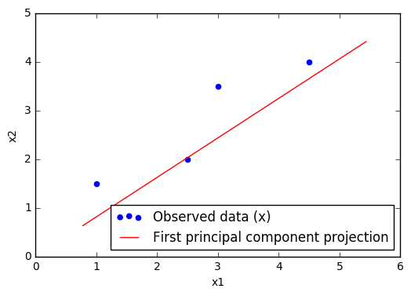

## GWU_DNSC 6314: Course Outline

Materials for an introduction to machine learning.

* Lecture 1: Preliminaries, Feature Engineering and Feature Selection
* Lecture 2: Contemporary Linear Model Approaches
* Lecture 3: Model Assessment and Selection
* Lecture 4: Decision Trees
* Lecture 5: Artificial Neural Networks
* Lecture 6: Other Estimators: Support Vector Machines (SVM) k-Nearest-Neighbors (*k*NN), etc.

Corrections or suggestions? Please file a [GitHub issue](https://github.com/jphall663/GWU_ML/issues/new).

***

## Preliminary Resources

* [Basic Data Manipulation](resource/basic_data_prep.md)
* [Primer on Technical Malpractice](https://docs.google.com/presentation/d/1cZeaoIp4cQsVY_gj2a5Pg7ygexepQZRS-ZEn6n2QqEU/edit?usp=sharing)
* [Syllabus](https://docs.google.com/document/d/1YORCBhsOqNT5pY7ltzigtaf4EuawgKyu0_Be0QiiVbg/edit?usp=sharing)
* [Whiteboard Notation](https://docs.google.com/presentation/d/1Axf9dizaE3XvGRelBHfsnAlMUPFuMExQ2WNVwQBKMrw/edit?usp=sharing)

## Lecture 1: Preliminaries, Feature Engineering and Feature Selection

**Source:** [Lecture 1 feature extraction example.](https://drive.google.com/file/d/1e_-015Zfx5sRdWXPR_6qFAC70rJuxFup/view?usp=sharing)

### Lecture 1 Class Materials

* [Lecture Notes](https://docs.google.com/presentation/d/1NkTZyspUaQ2CwDv_5yGE_7fwdrUsmUAy93rj_eFppK4/edit?usp=sharing)
* [Lecture 1 Feature Engineering Table](resource/feature_engeering.md)
* [Assignment 1](https://docs.google.com/document/d/1c_WOQMFyPMEiVgHXqyn9-pt7c1Kncl0wBbzCnvycc00/edit?usp=sharing)
* **Software Examples**:
  * [Feature selection](https://drive.google.com/file/d/1goBhzXLqjagd8EDyvQwgAtOYBIykIIr_/view?usp=sharing)
  * [Feature extraction](https://drive.google.com/file/d/1e_-015Zfx5sRdWXPR_6qFAC70rJuxFup/view?usp=sharing)
  * [Over- and under-sampling](https://drive.google.com/file/d/1fhat_dZhhqjAtPs2IJ5USA9wTVP5dJ2e/view?usp=sharing)
  * [Simple Encoding](https://drive.google.com/file/d/16anwAZt38Sr8j7Tl1gSSjBgV_e5bs8HA/view?usp=sharing)
  * [Target Encoding (Categorical)](https://drive.google.com/file/d/1HgBWhmryQwHtReaweoZdlJGMwtdqtu_M/view?usp=sharing)
  * [Target Encoding (Numeric)](https://drive.google.com/file/d/1Dg0YP1tgFs_ILMTLN6NywX-MP7vEOYPF/view?usp=sharing)
  * [Discretization](https://drive.google.com/file/d/1jSq65mivctrmu91rps3GoggLwoHoUM5P/view?usp=sharing)
  * [Winsorizing](https://drive.google.com/file/d/1SmGe_k1s0aRrzvP6mb4a7k8lbXoWEJg2/view?usp=sharing)
  * [Imputation](https://drive.google.com/file/d/1F57RnBa7x9fm_K9eEOaYEJqmyjrwA_Jq/view?usp=sharing)
  * [Standardization](https://drive.google.com/file/d/16uBhnFgU3NLO_hcAAGhF1e9TcsFq1lIe/view?usp=sharing)

All notebooks also available in the [`notebook`](notebook/lecture_1) folder.

### Lecture 1 Reading

* [*Label, Segment, Featurize: a cross domain framework for prediction engineering*](https://dai.lids.mit.edu/wp-content/uploads/2016/08/07796929.pdf)
* *Introduction to Data Mining* - Sections 2.2-2.3 ([Chapter 2 notes](https://www-users.cs.umn.edu/~kumar/dmbook/dmslides/chap2_data.pdf))
* [*Introduction to the Foundations of Causal Discovery*](https://www.its.caltech.edu/~fehardt/papers/Eberhardt_IJDSA2017.pdf) - Sections 1-4, and 7

### Lecture 1 Links
* [LiNGAM for causal discovery](https://sites.google.com/view/sshimizu06/lingam)
* [Causal Discovery Toolbox](https://github.com/FenTechSolutions/CausalDiscoveryToolbox)
* [pandas-profiling](https://github.com/pandas-profiling/pandas-profiling)

## Lecture 2: Contemporary Linear Model Approaches

**Source:** [From GLM to GBM: Building the Case For Complexity.](https://nbviewer.org/github/jphall663/interpretable_machine_learning_with_python/blob/master/glm_mgbm_gbm.ipynb)

### Lecture 2 Class Materials

* [Lecture Notes](https://docs.google.com/presentation/d/1a24nLOHOxEwS7GdNfvJAptb9ZD0Rmq_8lyXHJLb4deQ/edit?usp=sharing)
* [Lecture 2 Software Example]()
* [Assignment 2]()

All notebooks also available in the [`notebook`](notebook/lecture_2) folder.

### Lecture 2 Reading
* [_Elements of Statistical Learning_](https://hastie.su.domains/Papers/ESLII.pdf):
  * Sections 3.1 - 3.4
  * Section 4.4
* [_Regularization and variable selection via the elastic net_](https://hastie.su.domains/Papers/B67.2%20(2005)%20301-320%20Zou%20&%20Hastie.pdf)

### Lecture 2 Links

***

Some materials Copyright Patrick Hall and the H2O.ai team 2017-2020.  
